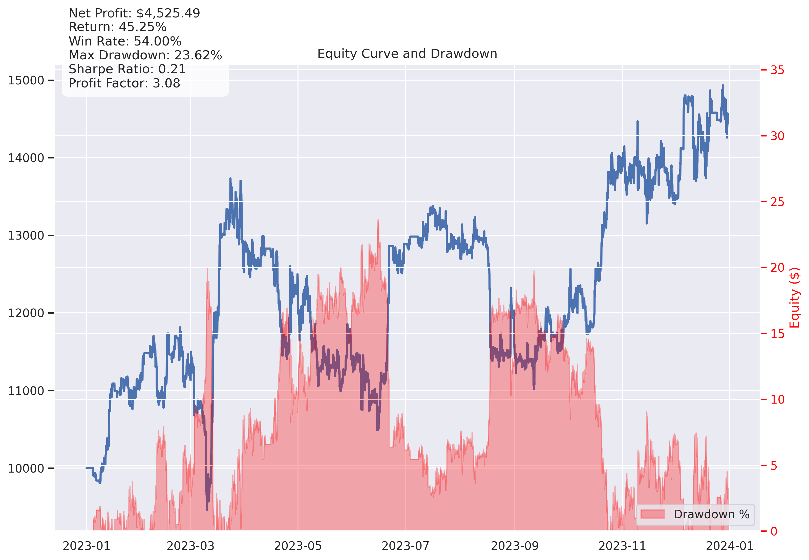
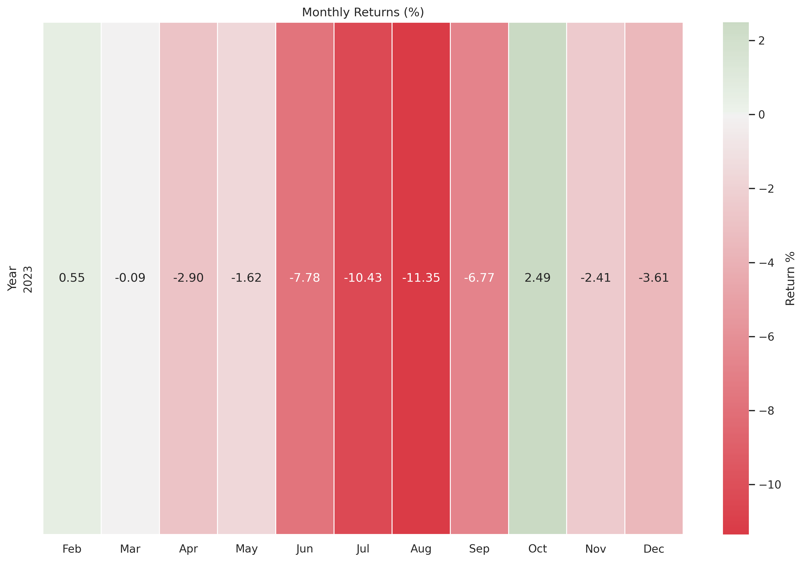
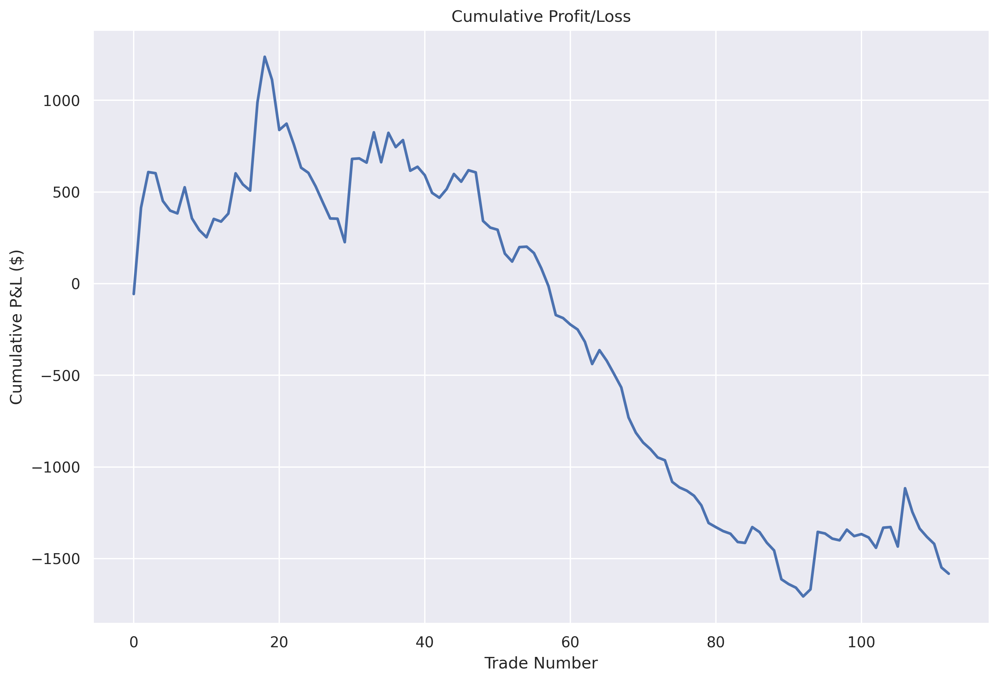
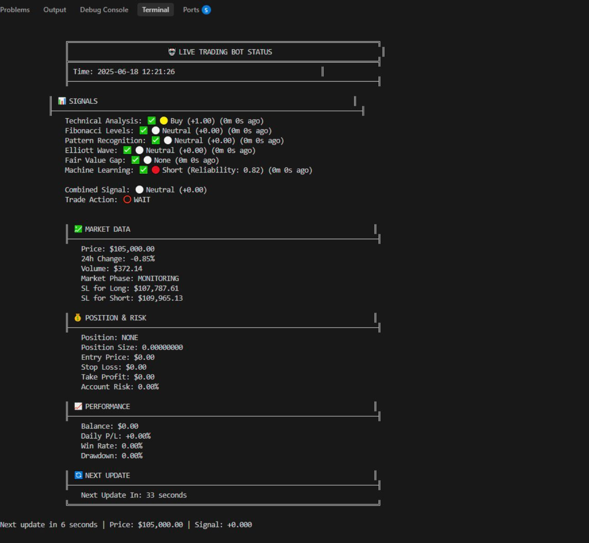
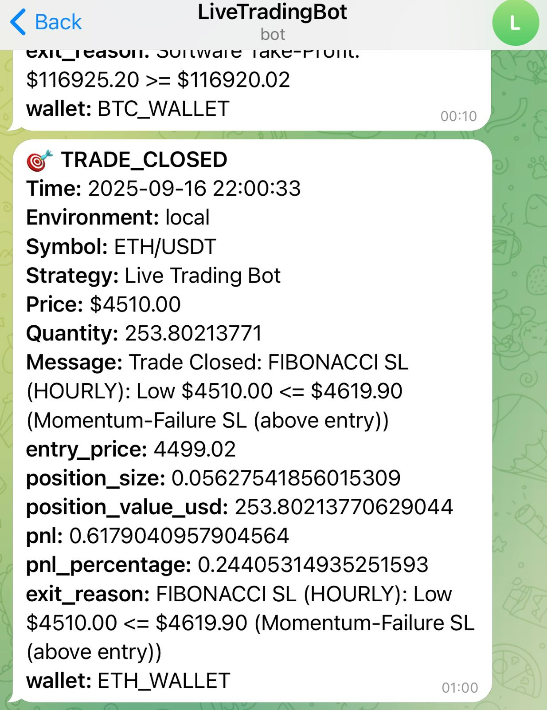

# Algo-Trader's Toolkit

[]()
[]()
[]()
[]()
[]()
[]()
[]()
[]()
[]()
[]()
[]()



A professional-grade algorithmic trading backtesting engine built with Python. Test your strategies with realistic market simulation, quant-grade metrics, and institutional-level analysis.

**Stop guessing. Start data-driven trading.**

*Save months of engineering time — tested, validated, production-ready.*

## 🛒 Get the Toolkit

👉 **[Buy on Gumroad](https://YOUR_GUMROAD_LINK)** | Standard $49 | Pro $149 | Ultimate $299 | Enterprise $749

---

## 👤 Who Is This For?

| Audience | Fit |
|----------|-----|
| Quant researchers | ✅ |
| Strategy developers | ✅ |
| Crypto spot traders | ✅ |
| Live automation users | ✅ |
| Data-driven traders | ✅ |
| High-leverage gamblers | ❌ |
| Get-rich-quick seekers | ❌ |
| Signal copiers | ❌ |

---

## 🎯 Verified Backtest Results

*All tiers tested using identical data, execution logic, and fee assumptions. Only unlocked modules differ.*

| Tier | Trades | Win Rate | Return | Max DD | Profit Factor | Sharpe |
|------|--------|----------|--------|--------|---------------|--------|
| **Standard** | 15 | 93.3% | +37.6% | 19.9% | 99.99* | 0.20 |
| **Pro** | 117 | 47.9% | +34.0% | 25.8% | 2.36 | 0.17 |
| **Ultimate** | 100 | 54.0% | +45.6% | 23.6% | 3.09 | 0.21 |
| **Enterprise** | — | — | — | — | — | — |

*\*Profit Factor capped at 99.99 for low sample sizes*
*Enterprise tier includes live trading - backtest results same as Ultimate*

### Test Conditions
- **Dataset:** BTC/USDT | 1h candles | 12-month period (2023)
- **Execution:** Spot trades only (no leverage or shorting)
- **Fees:** 0.10% realistic exchange fees included
- **Risk Model:** Fixed position sizing with controlled exposure

*Backtests shown are for demonstration of engine realism, not predictive forecasts.*

---

## 🔥 Key Feature: Intelligent Dynamic Stop-Loss

Our dynamic stop-loss system uses **Fibonacci retracement levels** that trail price movement:

| Tier | SL Exits | Profitable SL | % Profitable |
|------|----------|---------------|--------------|
| Standard | 13 | 13 | **100%** |
| Pro | 110 | 50 | **45%** |
| Ultimate | 94 | 49 | **52%** |

**Why this matters:** Stop-Loss exits ≠ Losses! The dynamic SL locks in profits as price moves favorably, acting as a trailing stop that protects gains. Dynamic SL reduces average losing trade size and increases reward-to-risk expectancy.

### 📈 Performance Visualizations

*Generated from Ultimate tier using BTC/USDT, 1h timeframe, 2023.*

#### Equity Curve & Drawdown


#### Monthly Returns Heatmap


#### Cumulative Profit/Loss by Trade


---

## 📦 What's Included (By Tier)

### Standard - Backtesting Engine
- ✅ High-fidelity market simulation (fees, slippage, execution delays)
- ✅ **12+ Technical Indicators** included:
  - Moving Averages: SMA (10, 30, 50, 200), EMA (10, 30)
  - Oscillators: RSI, MACD, ADX
  - Volatility: Bollinger Bands, ATR
  - Volume: OBV (On-Balance Volume)
- ✅ **Fibonacci Retracement Levels** (0.236, 0.382, 0.5, 0.618, 0.786)
- ✅ Multi-indicator strategy combining all signals
- ✅ High-confidence signal filtering
- ✅ Quant-grade performance metrics (Sharpe, Drawdown, Profit Factor)
- ✅ Data fetching with intelligent caching
- ✅ Equity curve visualization

### Pro - Trader's Toolkit
*Everything in Standard, plus:*
- ✅ **Pattern Recognition Engine** (50+ chart & candlestick patterns)
- ✅ Pattern reliability scoring (Bulkowski research-based)
- ✅ Classical target calculations (Edwards & Magee formulas)
- ✅ Combined Indicators + Patterns strategy
- ✅ Server deployment guide

### Ultimate - Quant Platform
*Everything in Pro, plus:*
- ✅ **Elliott Wave Analysis** (automatic wave counting)
- ✅ **Fair Value Gap (FVG) Strategy** (institutional order flow)
- ✅ **Machine Learning Pipeline** (XGBoost, RandomForest, LightGBM, MLP)
- ✅ **Intelligent Dynamic Stop-Loss** (Fibonacci-based trailing)
- ✅ Pre-trained ML models included
- ✅ Structure-based signal confirmation
- ✅ **train_model.py** - Train your own ML models
- ✅ **optimize.py** - Optimize strategy parameters

### Enterprise - Live Trading Platform
*Everything in Ultimate, plus:*

**Live Trading Infrastructure (14 production files):**
- ✅ **Live Trading Engine** (107 KB - full bot infrastructure)
- ✅ **Order Executor** (79 KB - real exchange order management)
- ✅ **Safety Monitor** (65 KB - risk management & circuit breakers)
- ✅ **Graceful Shutdown Handler** (54 KB - safe exit handling)
- ✅ **Professional Dashboard** (real-time terminal monitoring)
- ✅ **Telegram Notifications** (live alerts to your phone - EXCLUSIVE!)
- ✅ **Working Example Strategy** (uses all toolkit features)
- ✅ **Memory & Log Management** (production optimization)

**Complete Documentation (11 guides, 160+ KB):**
- ✅ **SSH Deployment Guide** - Deploy on DigitalOcean/AWS 24/7
- ✅ **API Rate Limits** - Exchange limits & handling
- ✅ **Emergency Shutdown** - Safety procedures
- ✅ **Order Management** - Order flow & execution
- ✅ **Position Sizing** - Dynamic position management
- ✅ **Telegram Setup** - Notification configuration
- ✅ **Multi-Wallet Trading** - Trade multiple assets

**Enterprise Exclusive Features:**
- ✅ Paper trading mode (test without risk)
- ✅ Bybit exchange integration
- ✅ Run 24/7 on cloud servers
- ✅ **Risk Gates** - Safety monitors ensure drawdown limits are respected before execution continues
- ✅ Production-ready, stress tested for 24/7 unattended operation

#### 🖥️ Live Trading Dashboard
*Real-time terminal monitoring with signals, market data, positions & performance*



#### 📱 Telegram Notifications
*Get instant alerts on your phone: signals, trade entries, exits with P&L*


<details>
  <summary>📲 More Telegram Examples (click to expand)</summary>
  <br>
  
</details>

---

## 🚀 Quick Start

### 1. Installation

```bash
pip install -r requirements.txt
```

### 2. Configuration

Edit `config.py` to customize your backtest:

```python
# Trading Settings
TRADING_PAIR = "BTC/USDT"
TIMEFRAME = "1h"
START_DATE = "2023-01-01"
END_DATE = "2023-12-31"

# Simulation Settings
INITIAL_CAPITAL = 10000.0
TRADING_FEE_PERCENT = 0.001  # 0.1% fee
SIMULATE_SLIPPAGE = True
```

### 3. Run Backtest

```bash
python run_backtest.py
```

### Sample Output

```
============================================================
                    BACKTEST RESULTS
============================================================
  Total Trades:        100
  Winning Trades:      54
  Losing Trades:       46
  Win Rate:            54.0%
  Total Return:        +45.56%
  Final Capital:       $14,556.42
  Max Drawdown:        23.60%
  Profit Factor:       3.09
  Sharpe Ratio:        0.21
============================================================

--- Exit Reasons ---
  Stop Loss: 94
  Take Profit: 5

  Note: 49/94 Stop Loss exits were PROFITABLE.
  Dynamic SL uses Fibonacci levels that trail price,
  locking in gains as the trade moves favorably.
```

---

## 📊 Why This Toolkit?

### vs Free Alternatives
1. **Realistic Simulation** - Most free tools ignore fees, slippage, and execution delays
2. **Production-Ready Code** - Extracted from a real trading system, not a tutorial
3. **Time Savings** - Building this from scratch takes 100+ hours
4. **Academic-Grade Patterns** - Based on Bulkowski's research & Edwards & Magee

### Quant Credibility
- Professional metrics (Sharpe, Sortino, Calmar ratios)
- Transparent sample size disclosures
- Exit reason breakdown with profit analysis
- Institutional-level stop-loss management

---

## 📁 Project Structure

```
├── run_backtest.py          # Main orchestration script
├── config.py                # All configuration settings
├── requirements.txt         # Python dependencies
├── core/
│   ├── market_simulator.py  # Trade execution engine
│   ├── performance_analyzer.py
│   └── enhanced_realism.py
├── data/
│   └── data_manager.py      # Data fetching & caching
├── analysis/                # [Pro/Ultimate only]
│   ├── patterns.py          # Chart pattern detection
│   ├── technical.py         # Technical indicators
│   ├── elliott.py           # Elliott Wave [Ultimate]
│   ├── fvg.py               # Fair Value Gap [Ultimate]
│   └── ml.py                # Machine Learning [Ultimate]
└── backtest_results/        # Generated reports & charts
```

---

## ⚠️ Disclaimer

This is a **backtesting engine**, not a collection of profitable trading strategies. Past performance does not guarantee future results. The included strategies are for demonstration purposes. Always do your own research and risk management.

---

## � Pricing

| Tier | Price | Best For |
|------|-------|----------|
| **Standard** | $49 | Fast strategy testing with 12+ indicators & Fibonacci levels |
| **Pro** | $149 | Automating technical & pattern-based trading workflows |
| **Ultimate** | $299 | Quant-level research, ML validation, and multi-factor confirmation |
| **Enterprise** | $749 | Fully unattended live trading with real-time safety gates |

✅ **All toolkits include:** Lifetime access, commercial use rights, and free version updates.

� **One-time purchase — no subscriptions.**

�� *Building this from scratch typically takes 120–210 development hours. The toolkit costs less than 0.5% of that engineering effort.*

---

## 🚀 Upgrade Path

```
Standard  →  Pro  →  Ultimate  →  Enterprise
    |           |         |            |
Indicators   Patterns   ML/FVG    24/7 Live
+ Fibonacci  + Charts   + Elliott  + Telegram
```

| Tier | What's Included |
|------|-----------------|
| **Standard** | 12+ indicators, Fibonacci levels, realistic backtesting |
| **Pro** | *Everything in Standard* + Pattern recognition + chart patterns + candlestick analysis |
| **Ultimate** | *Everything in Pro* + ML pipeline + Elliott Wave + FVG + intelligent exits |
| **Enterprise** | *Everything in Ultimate* + **LIVE TRADING** + safety monitors + Telegram alerts |

🌟 **Save when upgrading** — upgrading costs less than buying separate tiers.

📩 **Enterprise includes:** Onboarding assistance + priority email support.

🔐 **Licensed distributions include traceable signatures to prevent unauthorized resale.**

*Contact for bundle deals and custom integrations:* **algo.toolkitt@gmail.com**

👉 **[Get the Toolkit on Gumroad](https://YOUR_GUMROAD_LINK)**

---

## 🧠 Why 99% of Trading Bots Fail

Most "bots" sold on Telegram and Gumroad fail because they lack:

| Missing Component | Our Solution |
|-------------------|--------------|
| No risk gates | ✅ 11 safety protection layers |
| No realistic simulation | ✅ Fees, slippage, execution delays modeled |
| No execution engine | ✅ Production-ready order executor |
| No slippage modeling | ✅ Realistic market impact simulation |
| No ML confirmation | ✅ 4 ML models (XGBoost, RF, LightGBM, MLP) |
| No structural analysis | ✅ Elliott Wave + FVG detection |
| No dynamic stop-loss | ✅ Fibonacci trailing stops |
| No cloud deployment | ✅ Full SSH deployment guides |
| No safety shutdowns | ✅ Emergency shutdown + graceful exit |
| No position management | ✅ Dynamic sizing with risk limits |

**This toolkit exists to solve those engineering gaps.**

---

## 💼 Real Use Cases

> *"I used the Ultimate tier to test 120+ strategy variations in two weeks without writing execution code from scratch."*
> — Crypto quant researcher

> *"Deployed Enterprise tier on DigitalOcean with Telegram alerts. Now I have fully unattended signal monitoring running 24/7."*
> — System trader

> *"The pattern recognition saved me months of development. Edwards & Magee formulas are implemented correctly with proper target calculations."*
> — Strategy developer

---

## ❓ FAQ

**Q: Is this a guaranteed-profit trading bot?**
A: No. This is a professional backtesting and research toolkit, not an auto-profit strategy. Past performance does not guarantee future results.

**Q: Can I deploy strategies live?**
A: Yes — Enterprise tier includes full live trading infrastructure with safety monitors and risk gates.

**Q: Can I train my own ML models?**
A: Yes — Ultimate includes a full ML pipeline (`train_model.py`) plus 4 pre-trained models.

**Q: Can I run this on a cloud server?**
A: Yes — we include full SSH deployment guides and 24/7 server operation instructions.

**Q: Which tier should I start with?**
A:
- **Standard** → Best for learning & testing ideas
- **Pro** → Best for pattern-based automation
- **Ultimate** → Best for quant research & ML
- **Enterprise** → Best for live trading operations

---

## 🚫 Who This Is NOT For

This toolkit is **not for**:
- ❌ High-leverage gamblers
- ❌ Plug-and-play profit seekers
- ❌ Get-rich-quick users
- ❌ Those unwilling to learn

This toolkit **IS for**:
- ✅ Developers building trading systems
- ✅ Quants and analysts doing research
- ✅ System traders validating ideas
- ✅ Professionals who understand risk

---

## 📜 License

This software is sold under a **single-user commercial license**. See `LICENSE.txt` for full terms.

- ✅ Use for personal/commercial trading
- ✅ Modify for your own use
- ✅ Deploy on your servers
- ❌ Resale, redistribution, or sharing is **strictly prohibited**
- ❌ Unauthorized distribution = DMCA takedown + legal action

⚠️ **All licensed distributions contain unique watermark signatures. Unauthorized resale or sharing can be traced and prosecuted.**

---

## 📧 Contact & Support

**Email:** algo.toolkitt@gmail.com

**This is a commercial product.** Source code is not included in this public repository.
Full source code is delivered upon purchase via Gumroad.

---

**Refund Policy:** Refunds are evaluated case-by-case for technical access issues, not performance guarantees.

---

*Built with ❤️ for serious traders who demand quant-grade tools.*

👉 **[Get the Toolkit on Gumroad](https://YOUR_GUMROAD_LINK)**
